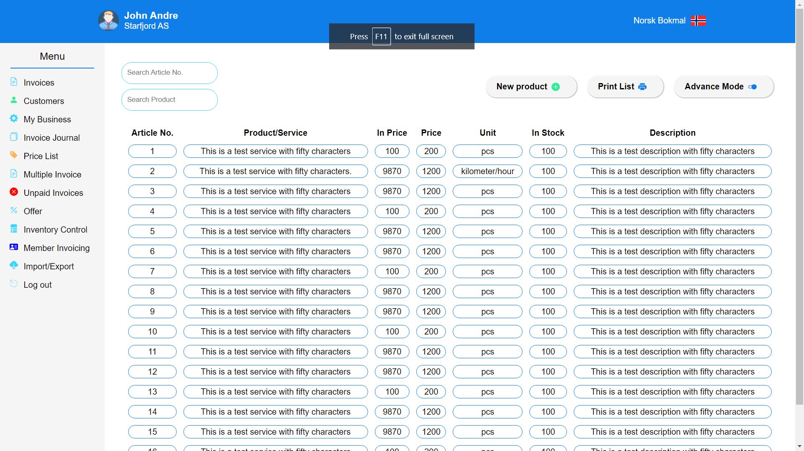
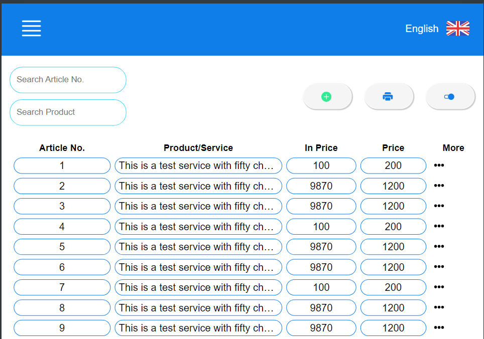

# Pricelist

Project created while replicating some figma design found on internet.

## Table of Contents

- [Installation and Usage](#installation-and-usage)
- [Details](#details)
- [Screenshots](#screenshots)

## Installation and Usage

`node.js` must be installed in the machine. `VS Code` is recommend IDE to use the project.

1. Clone the repository.
2. Execute `npm i` in the terminal
3. Execute `npm run dev` to run the project and visit the localhost in your browser.

> Note: `npm run build` command can be used to build the project with vite.

## Details:

- Project created with React with Javascript.
- Vite is used as build tool.
- Data showing in the application is from a file, `price.json`. No backend of API fetching is used.

## Screenshots:

